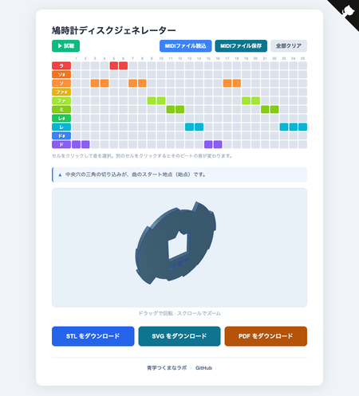

# 鳩時計ディスクジェネレーター

3Dプリンターで製作できるオルゴール（ミュージックボックス）用ディスクの STL ファイルを、ブラウザ上で生成する Web アプリです。



## 概要

オルゴール機構の「琴爪（きんそう）」は、ディスクの歯（突起）の高さに応じてどの音が鳴るかが決まります。このアプリでは 25 分割されたディスクの各セクターに音符を割り当て、好みのメロディを奏でるディスクを設計・出力できます。

## 使い方

1. ブラウザで `index.html` を開く（静的 HTTP サーバーで配信）
2. ピアノロールのセルをクリックして 25 ビートに音を割り当て
3. 「▶ 試聴」でメロディを Web Audio で確認
4. 「STL をダウンロード」で 3D プリント用ファイル（`melody_disk.stl`）を取得
5. 3D プリンターでプリントし、オルゴール機構にセット

### UI 要素

| 要素 | 内容 |
|---|---|
| ピアノロール | 縦軸＝10 段階の音（半音階・ラ〜ド）、横軸＝25 ビート |
| セルクリック | そのビートに音を割り当て／同じセルを再クリックで休符（直前の音と同じ径） |
| ▶ 試聴 | 全 25 ビートを再生（triangle 波）。テンポは初期 ♩=300、MIDI 読込後はそのテンポ |
| MIDIファイル読込 | MIDI（SMF）を読み込んでピアノロールへ反映（1 拍 = 4 分音符、ラ〜ドへオクターブ畳み込み） |
| MIDIファイル保存 | 現在のメロディを MIDI（`melody.midi`、25/4 拍子・試聴と同じテンポ）として書き出し |
| 全部クリア | 全ビートを休符にリセット |
| 3D プレビュー | ドラッグで回転 · スクロールでズーム |
| STL をダウンロード | 現在のメロディをディスク形状（STL）として書き出し |

## ディスク仕様

| パラメーター | 値 |
|---|---|
| セクター数 | 25 等分 |
| 厚さ | 1.8 mm |
| 中央穴 | 10.5 × 10.5 mm 正方形 |
| 開始マーカー | 正方形穴の +X 方向の壁に V字溝（幅 1.0mm・深さ 1.5mm） |

中央の正方形穴は、オルゴール機構の回転軸に取り付けるためのものです。V字溝がある側がセクター 1（メロディの最初の音）の開始位置です。

## 歯の高さ（外径）と音階の関係

オルゴール機構では**外径が大きいほど高い音**が鳴ります。琴爪の長さが外径によって決まり、短い琴爪ほど高周波で振動するためです。

この機構は **φ30〜φ40mm の範囲であれば、どの外径でも音が鳴る** 連続構造になっています。離散的な「5 つの琴爪」が並んでいるわけではなく、歯の高さに応じてピッチが連続的に変化します。本アプリではこの範囲を 10 段階に等分割して、半音階の「鍵盤」としてピアノロールに並べています。

| ノート番号 | 階名 | 外径 | 半径（コード値） | 試聴音（ドレミ／音名／周波数） |
|---|---|---|---|---|
| 0 | ラ | φ40.00 mm | 20.000 mm | ラ4 / A4 / 440 Hz |
| 1 | ソ# | φ38.75 mm | 19.375 mm | ソ#4 / G#4 / 415 Hz |
| 2 | ソ | φ37.50 mm | 18.750 mm | ソ4 / G4 / 392 Hz |
| 3 | ファ# | φ36.67 mm | 18.333 mm | ファ#4 / F#4 / 370 Hz |
| 4 | ファ | φ35.83 mm | 17.917 mm | ファ4 / F4 / 349 Hz |
| 5 | ミ | φ35.00 mm | 17.500 mm | ミ4 / E4 / 330 Hz |
| 6 | レ# | φ33.75 mm | 16.875 mm | レ#4 / D#4 / 311 Hz |
| 7 | レ | φ32.50 mm | 16.250 mm | レ4 / D4 / 294 Hz |
| 8 | ド# | φ31.25 mm | 15.625 mm | ド#4 / C#4 / 277 Hz |
| 9 | ド | φ30.00 mm | 15.000 mm | ド4 / C4 / 262 Hz |

### ⚠ 試聴音と実機の音は別物です

ピアノロールで「ラ」と打ち込むと、ブラウザは **A4＝440Hz** を鳴らしますが、実機のディスクが鳴らすのは **A4 ではありません**。試聴と実機の音は、次の 2 つの点で違います。

#### ① オクターブが約 3 つ違う

実機の音は **第 7 オクターブ**（2400〜3800Hz）の高音域です。機構が小型で琴爪が短いため、固有振動数が高くなります。ブラウザ試聴は耳に優しい **第 4 オクターブ**（中央ハ周辺、262〜440Hz）に置いていて、メロディの形（上がる／下がる／繰り返し）を確認するためのものです。

#### ② 音の並び方が違う（試聴と実機で「ラ」が指す音が違う）

ピアノロールの「ラ」「ソ」「ミ」「ド」… は **ピアノの白鍵・黒鍵に揃えた音の並び**（音楽でいう「平均律」）です。これは人間の耳に馴染みがあり、メロディが綺麗に聞こえるように人工的に整えてあります。

一方、実機は金属パーツを物理的に振動させて鳴らす機構なので、出る音は機構の形状や材質で勝手に決まります。φ40mm を「ラ」のつもりで打ち込んでも、実機が出すのは「ラ（A）」ではなく **少し高い「シ♭（Bb）」**。同様に「ミ」のつもりが「ソ#」、「ド」のつもりが「レ」のあたり、というふうに、**全部ズレた音名で鳴ります**。

#### でもこれで OK な理由

「ピアノロールの音名と実機の音が一致しないなら、試聴は何のためにあるの？」と思うかもしれません。これで OK な理由は：

- **メロディは「音の名前」ではなく「音の上下のパターン」で認識される。** たとえば「ド ド ソ ソ ラ ラ ソ」を全体的に半音や全音ずらしても、上がる場所・下がる場所・繰り返す場所が同じなら、人は **同じキラキラ星** だと聞き取れます。カラオケで自分のキーに合わせて歌っても曲が変わらないのと同じです。
- アプリの試聴も実機も、**外径が大きい歯ほど高い音、小さい歯ほど低い音** という性質は共通しています。だから「ピアノロールで聞いて気持ちよく流れたメロディ」は、実機でもだいたい同じ上下のパターンで流れます。
- 試聴の役割は「**メロディの形（ジングルの感じ）**」を耳で確認すること。「**絶対的にこの音が鳴る**」ことを約束するものではありません。

なお、実機の音は平均律ではないので、**ピアノロール上の音間隔と実機の音間隔は完全には一致しません。** たとえば試聴で「ドとソは 5 度離れている」と聞こえても、実機では同じ 2 か所が「5 度よりやや狭い」「半音ほど広い」など微妙にズレることがあります。それでも「上がる・下がる・繰り返す」の骨格は保たれるので、メロディとして認識できる、というのが基本的な発想です。

### 休符の扱い

ディスク上に「休符」という概念はありません。エディター上で何も選択していないビート（休符）は、STL 出力時に**直前のビートと同じ外径**として扱われます。これによりすべてのセクターが機構に確実にかかり、同じ音が連続して鳴る形になります。

### 実測値（参考）

5 つの代表的な外径について、単音テストディスクを実機にかけてマイクで録音・解析した結果です。この 5 点は機構が出せる音の **代表サンプル** であり、間の径（例：φ36.67mm）でも音は鳴ります（連続的に変化します）。

| 外径 | 実測音名（ドレミ／音名） | 代表周波数 | 備考 |
|---|---|---|---|
| φ40mm | **シ♭7（ラ#7） / Bb7（A#7）** | ~3709 Hz | ボディ共鳴との差分で同定 |
| φ37.5mm | ファ#7 / F#7（参考値） | ~2980 Hz | 5音サイクルディスクからの推定 |
| φ35mm | **ソ#7（ラ♭7） / G#7（Ab7）** | ~3406 Hz | 非常に安定した測定値 |
| φ32.5mm | 未同定 | 不安定 | サイクルごとにスペクトル変動 |
| φ30mm | **レ7〜レ#7 / D7〜D#7** | ~2420 Hz | D7 より約 +30¢ 高め |

- φ40mm と φ35mm はどちらも G#7 付近（~3350 Hz）に強いピークを持ちますが、これは機構本体の**ボディ共鳴（胴鳴り）**です。φ40mm 固有の音は差分スペクトルで求めた Bb7（~3710 Hz）です。
- φ32.5mm の音名が「未同定」なのは、機構が鳴らないからではなく、サイクルごとに測定スペクトルが変動して安定したピークを特定できなかったためです。
- 解析ツール: Python + soundfile + scipy（macOS `afconvert` で m4a → WAV 変換）

## デフォルトメロディ（キラキラ星）

起動時のメロディは「キラキラ星」（25 ビート）です：

```
ビート 1– 8: ド ド ソ ソ ラ ラ ソ ソ
ビート 9–16: ファ ファ ミ ミ レ レ ド ド
ビート17–25: ソ ソ ファ ファ ミ ミ レ レ レ
```

## ファイル構成

```
cuckoo-clock/
├── index.html        # HTML マークアップ
├── style.css         # スタイルシート
├── app.js            # Three.js プレビュー + STL 生成 + UI ロジック
├── docs/
│   └── screenshot.png  # README 用スクリーンショット
└── README.md         # このファイル
```

## 動作環境

- モダンブラウザ（Chrome / Firefox / Safari / Edge）
- ES Modules と importmap をサポートする環境
- Three.js は CDN（jsdelivr）から読み込み（インターネット接続が必要）

ローカルで動作させる場合は HTTP サーバーが必要です：

```bash
python3 -m http.server 8080
# または
npx serve .
```

## ライセンス

MIT
